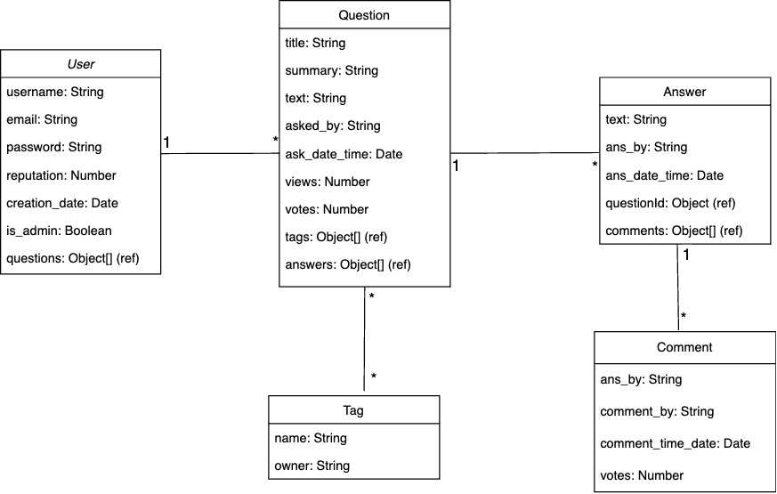

[](https://classroom.github.com/a/tRxoBzS5)
Add design docs in *images/*

---

---

## Instructions to setup and run project

## Tony Bui Contribution
Login, Logout, Home Page, New Question, Answers, Comments, UserProfile
## Team Member 2 Contribution
Register, Guest, WelcomePage, Admin, Tags, Search, UserProfile


## Project Setup Instructions

This document outlines the steps required to set up the development environment for both the server and client components of the project.

### Prerequisites

Before you begin, ensure you have the following installed on your system:
- Git
- Node.js
- npm
- OpenSSL (for generating JWT secret)

### Cloning the Repository

Clone the repository to your local machine using:

```bash
git clone git@github.com:sbu-ckane-s24-cse316-pa04org/pa04-divinedragons.git
or https://github.com/sbu-ckane-s24-cse316-pa04org/pa04-divinedragons.git
cd pa04-divinedragons
```

### Server Setup
Follow these steps to set up the server:

```bash
cd server
```
1. Navigate to the server directory:
```bash
cd server
```
2. Install dependencies:
```bash
npm install
```
3. Generate a secret key for JWT:
```bash
openssl rand -base64 32
```
Copy the output and use it in the next step.
4. Configure environment variables:Create a .env file in the server directory and add the following content:
```
PORT=8000
MONGO_URI="mongodb://127.0.0.1:27017/fake_so"
JWT_SECRET="Paste your SECRET KEY here"
```
5. Start the server:
```bash
nodemon server.js
```
### Client Setup
Set up the client by following these steps:
1. Open a new terminal and navigate to the client directory:
```bash
cd path/to/client
```
2. Install client dependencies:
```bash
npm install
```
3. Start the client application:
```bash
npm start
```

### Initialization
Initialize data by running:
```bash
node init.js [Admin username] [password]
```


